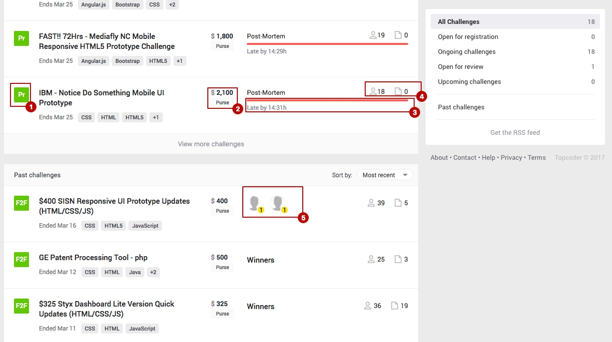
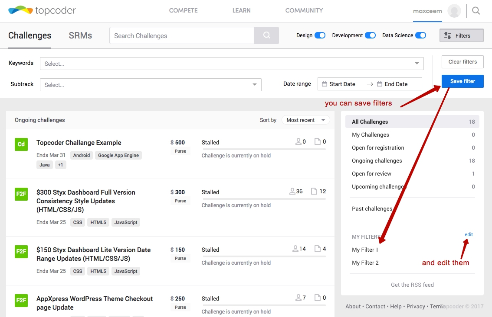
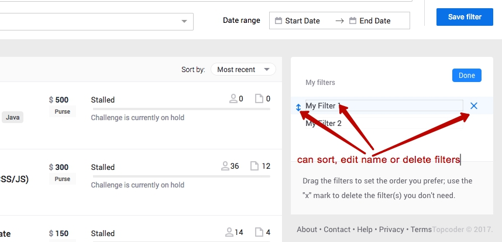

# TOPCODER COMMUNITIES - LISTING OF RELEVANT CHALLENGES

## VIDEO
Video on YouTube available by [link](https://youtu.be/00gz41hFakY) only

## DONE
I've used the preferred way of implementing challenge and moved all the necessary files from `react-component` project to `community-app` project.
- No lint errors introduced
- Unit test are passed
- Unit test coverage is out of threshold, but it's allowed by @birdofpreyru
- Using the `ChallengeFilterExample` component for Topcoder App supposed to work, as no props were deleted and all the introduced props are optional
- Master filter is defined as a function inside container `ChallengeListing` component and passed to the `ChallengeFilterExample` component as an optional property. So it can be changed to absolutely any filter or can be skipped at all.
- All the functionality of `ChallengeFilterExample` component fully works inside `community-app` project.

## VERIFICATION

### Linting and tests
- To check that there are not lint errors, run `npm run lint`
- To check that there are no test failed, run `npm run jest`. Test coverage thresholds are only failed. Some warning are being displayed but no test are being broken.

### Functionality

Before opening the project it's better to login at http://accounts.topcoder-dev.com/member to get access to all the functionality.

Note. When you open pages of the project, there dev-tools are shown on the right side. To hide it press `Ctrl + M`.

#### 1. Master filter
Now master filter is configured to filter challenges by technology tag which is being retrieved from the url. To check it, follow the for challenges filtered by `JavaScript` http://local.topcoder-dev.com:3000/community-challenge-listing/JavaScript. It can be easily seen, that all displayed challenges has `JavaScript` tag in their description. You also can change the url to filter challenges by other tags, [`ajax` for example](http://local.topcoder-dev.com:3000/community-challenge-listing/ajax)

#### 2. Other filters can be combined with the master filter
Just apply any other filter on the page. On the screen below there are pointed several ways to add additional filters.

#### 3. Tooltips
There are several places where tooltips should appear. Pointed on the screen below.

#### 3. Save filters
There is also functionality for saving custom filters. It works only particularly. You can still save them visually and edit. But they are not being saved on the server and also you cannot apply them. These issues comes from `react-component` project.

Also editing saved filters works.

## ADDITIONALLY
- Added 'run fix:js' command to package to fix js lint errors
- Fixed challenges sorting dropdown which cut some items (this issue now is happening on the production website also)

## KNOWN ISSUES
A list of known issues is provided to help recognizing existent problems. They are not connected directly to the challenge scope or were confirmed by @birdofpreyru as out of scope.
- Custom user filters on filter sidebar are not displayed on mobile resolutions (same on production website)
- DevTools in Chrome, Safari and probably other browsers work very slow. Possible reason is that in many component styles we include main style using
  scss import `@import '~styles/tc-style'`.
  But unlike webpack, scss import includes files content every time we call it instead of only once. It makes css bundle file very big which probably slowing down DevTools.
- `run fix:styles` may break `run lint:scss`, submitted an [issue](https://github.com/topcoder-platform/community-app/issues/21)
- "save filter" doesn't save filter on the server but produces errors.
  When we press it, not only we add a custom filter to the component's state, but also send to https://lc1-user-settings-service.herokuapp.com/saved-searches.

  This rises an issue with CORS even though I use domain 'http://local.topcoder-dev.com/' for local development.

  `bundle.js:117754 OPTIONS https://lc1-user-settings-service.herokuapp.com/saved-searches 401 (Unauthorized)`

  `Fetch API cannot load https://lc1-user-settings-service.herokuapp.com/saved-searches. Response to preflight request doesn't pass access control check: No 'Access-Control-Allow-Origin' header is present on the requested resource. Origin 'http://local.topcoder-dev.com:3000' is therefore not allowed access. The response had HTTP status code 401. If an opaque response serves your needs, set the request's mode to 'no-cors' to fetch the resource with CORS disabled.`

  `android#&tracks=datasci&tracks=design&tracks=develop&mode=4&name=Past%20challenges:1 Uncaught (in promise) TypeError: Failed to fetch`

  Same behaviour if we run `react-compenents` project or use https://www.topcoder-dev.com/challenges/
- When we click on the saved custom filters, visually they restore the their settings, but no results are being shown. This issue comes from `react-component` package.
- New warning in browser console:
  `Warning: AutosizeInput: React.createClass is deprecated and will be removed in version 16. Use plain JavaScript classes instead. If you're not yet ready to migrate, create-react-class is available on npm as a drop-in replacement.`
  This warning is produced by the `AutosizeInput` component which is used by `react-select` module. I've checked the repository of the later one, it's still alive and this issue https://github.com/JedWatson/react-select/issues/1661 has some moving lately . So hopefully this module can be updated soon and this warning will disappear. I think it doesn't worth to change the lib because of a warning taking into account the issue is being addressed in the repo.

- There is and issue with `DateRangePicker` from `react-dates` produces errors in browser console during usage. But it still works.
  The same errors are produced in `react-component` project and on https://www.topcoder-dev.com/challenges/.
  I think it's not hard to fix, but as it come from react-components project, and not caused by migration, I'd like to skip it for now, as the scope of fixes during migration already is very big.
- There are two warning are being showed during jest tests but they don't break any tests

  `Warning: AutosizeInput: React.createClass is deprecated and will be removed in version 16. Use plain JavaScript classes instead. If you're not yet ready to migrate, create-react-class is available on npm as a drop-in replacement.`

  `Warning: Accessing PropTypes via the main React package is deprecated. Use the prop-types package from npm instead.`

  The first one is brought by `AutosizeInput` which was described in 1.
  The second one can be brought by both `AutosizeInput` and `react-dates` as they both use them. For the `AutosizeInput` we are waiting for repo update, for the `react-dates` it looks like already fixed in the newer version. But I hope updating is out of the scope as I've tried it a little bit, but after spending some time without any luck to run it I came back to the version used in `react-components`.
