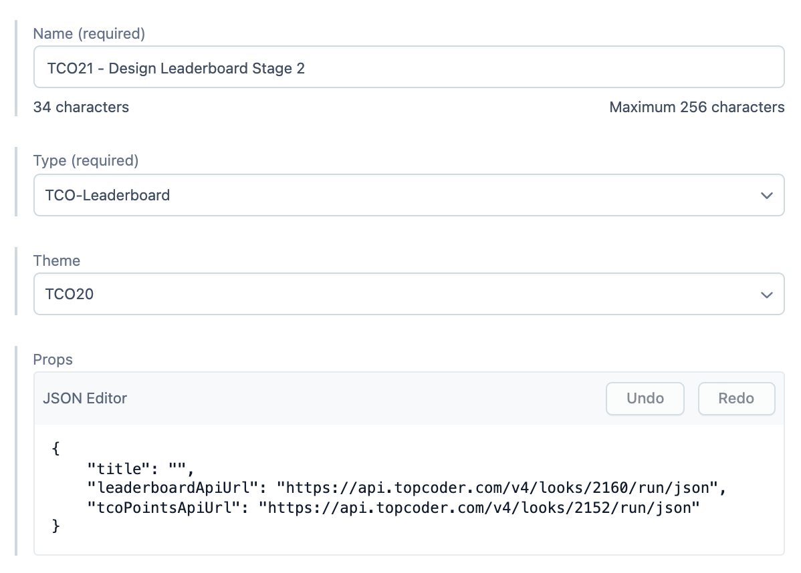
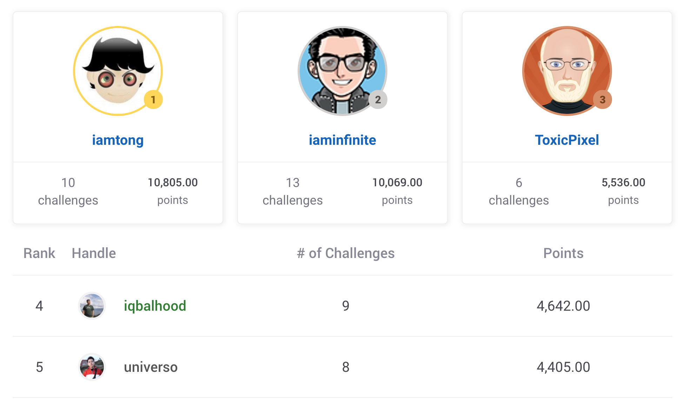
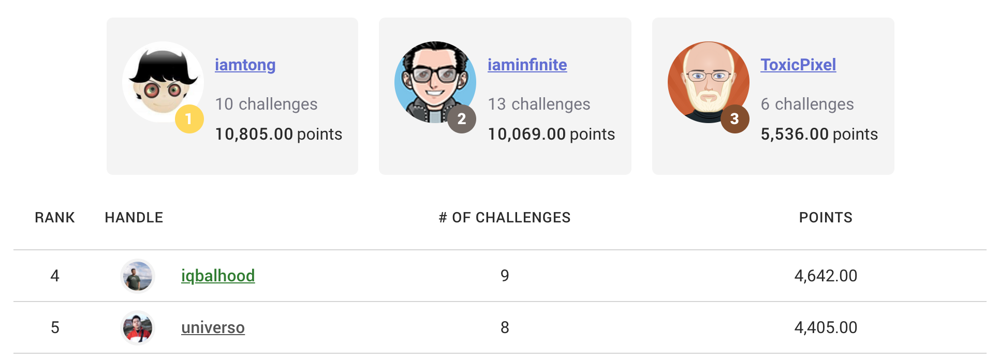
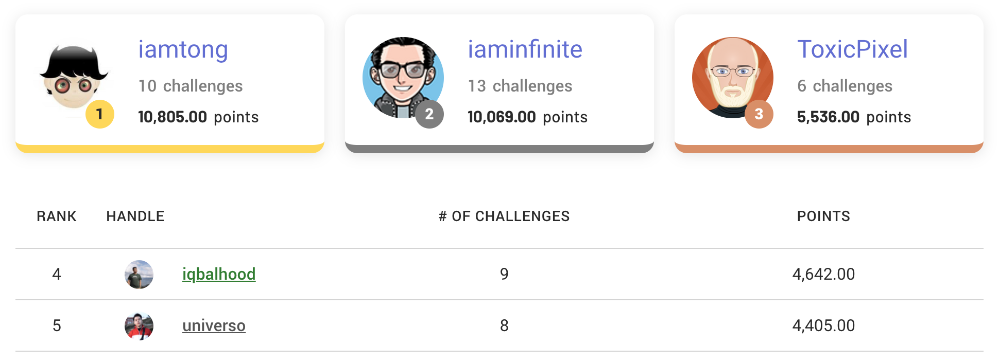

# App Component

Generic App Component model.

**Preview:** https://community-app.topcoder.com/examples/contentful/viewport/7szFFbYqzZLpWkZwqZlXSJ

## Fields

- **Name** | Name of the entry.
- **Type** | Type of the App Component. Each type has different props. Please refer to [props](#props-json-object) field below.
- **Theme** | Theme specific for `TCO-Leaderboard` type.
- **Props** | Each type has its own props. Please refer to [props](#props-json-object) field below.

## TCO-Leaderboard Themes

### Default

### TCO20

### TCO22

## Props (JSON Object)

### Type = `TCO-Leaderboard`

Render top spots and list of competitors on specific TCO track.

- **apiUrl** | **String.** Looks API URL | Default: "https://api.topcoder.com/v4/looks/1044/run/json".
- **title** | **String.** Title of the leaderboard. | Default: "Leaderboard".
- **podiumSpots** | **Number.** Number of displayed top spots. | Default: 3.
- **isCopilot** | **Bool.** Display copilot specific fields. | Default: false
- **hasChallengeHistory** | Bool. Display modal of competitor history. | Default: true
- **tcoPointsApiUrl** | **String.** Looks API URL for competitior challenge history. | Default: null
- **memberLimit** | **Number.** Limit the displayed number of rows. | Default: null
- **isAlgo** | **Bool.** Display copilot specific fields. | Default: false

### Type = `RecruitCRM-Jobs`

A block that fetches and renders a job listing page driven by recruitCRM.

Generic subscribe for MailChimp tags component.

- **listId** | **String (Required).**
- **interests** | **String (Required).**
- **title** | **String.**
- **btnText** | **String.**
- **successTitle** | **String.**
- **successText** | **String.**
- **successLink** | **String.**
- **successLinkText** | **String.**

### Type = `GSheet`

Render table that loads data from Google Sheet.

- **id** | **String (Required).** Google sheet ID.
- **index** | **Number.** The index of the sheet to render, starts by 0 and counting.
- **config** | **Object of:**
  - **pick** | **Array of Strings.** Pick sheet header value as table header.
  - **containerStyle** | **CSS Object.** Inline styles object to override the container style.

### Type = `JSON`

JSON object needed by 3rd party API.

### Type = `MemberPath`

Render MemberPath component specifically for http://topcoder.com/start page.

- **data** | **Object of:**
  - **title** | **String.** Big top title.
  - **items** | **Array of Objects of:**
    - **title** | **String.** Box title.
    - **iconURL** | **String.** URL of the icon.
    - **activeIconURL** | **String.** URL of icon when box is active.
    - **contentText** | **String.** Displayed text at the bottom content.
    - **btnText** | **String.** Text of the button at the bottom content.
    - **btnURL** | **String.** Target link of the button at the bottom content.
    - **btnNewTab** | **Bool.** Boolean to control the button to open new tab or not.
