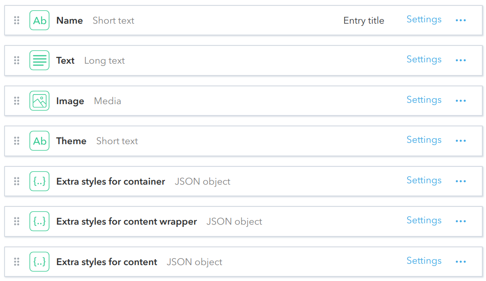

# Content Block
The first content type you should consider for your content elements inside a viewport. It allows you to insert into the page arbitrary text (supporting Markdown and HTML syntax), as well as misc inline UI elements, specific to our website (buttons, internal hyper-references, modals, etc.). It also supports the *image + text* type of content, for cases when, rather than an inline image, you need some special layout of the image with respect to the textual content. We also support different styles for content blocks via themes.

## Fields

## Live Demo
https://community-app.topcoder.com/examples/contentful/viewport/2Vf6Xn8CaNG4C55nqblsZa
