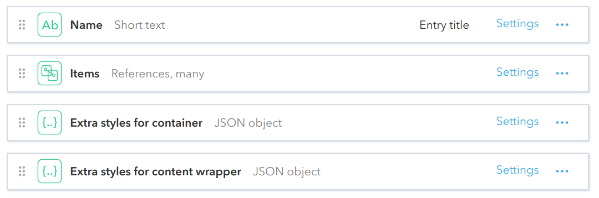
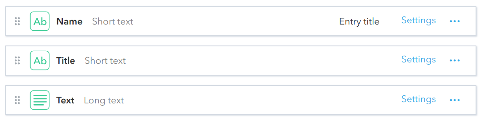

# Dropdown
The component for blocks of content rendered in dropdows. Renders a list of **Dropdown Items** objects, that provide content for it.

## Fields
**Dropdown**

**Dropdown Item**

## Live Demo
https://community-app.topcoder.com/examples/contentful/viewport/5ve2acdU6Z3C5FyXMO99El
