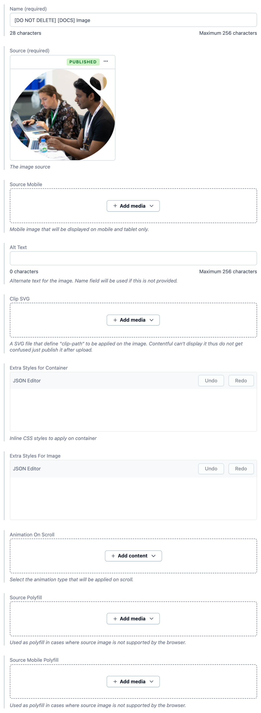

# Image

Generic Image model.

**Preview:** https://community-app.topcoder.com/examples/contentful/viewport/1HRSb4Bls4S2mQesG6mJOn

## Fields

- **Name** | Name of the entry.
- **Source** | The image source.
- **Source Mobile** | The image source for mobile view. This image will be shown when viewport width is lower than and equals to 768px.
- **Alt Text** | Alternate text for the image. Name field will be used if this is not provided.
- **Clip SVG** | A SVG file that define "clip-path" to be applied on the image. Contentful can't display it thus do not get confused just publish it after upload.
- **Extra Styles for Container** | Inline CSS styles to apply on container.
- **Extra Styles For Image** | Inline CSS styles to apply on `` tag itself.
- **Animation On Scroll** | Animation type to apply on scroll. Please refer to [Animation](./Animation.md) for more details.
- **Source Polyfill** | Used as polyfill in cases where source image is not supported by the browser.
- **Source Mobile Polyfill** | Used as polyfill in cases where source image is not supported by the browser. This polyfill will be shown when viewport width is lower than and equals to 768px.