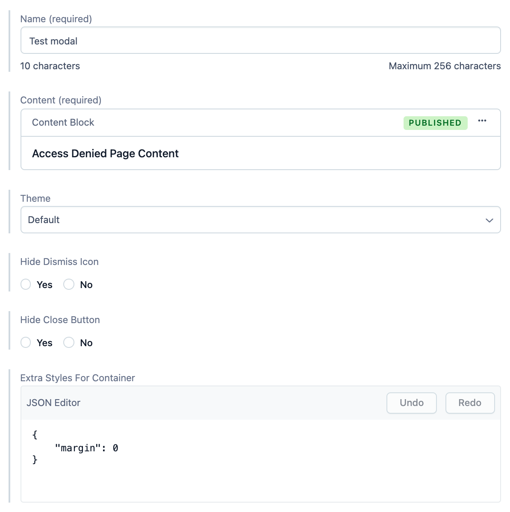

# Modal

Generic Modal model.



**Preview:** https://community-app.topcoder.com/examples/contentful/contentblock/75fw42BmbyloyIseNH7gsY

## Fields

- **Name** | Name of the entry.
- **Content** | Content entry of the modal.
- **Theme** | Modal theme.
- **Hide Dismiss Icon** | Whether to hide the dismiss icon.
- **Hide Close Button** | By default, modals will render close button inside it.
- **Extra Styles For Container** | CSS inline styles to override the modal container's style.

## How to use

In order to use modal, we need to create [Content Block](./ContentBlock.md) entry, and put the modal entry's ID into the text field of the Content Block like so:

```
<Modal id="6U2MKViRUKnJsw6PbO6201">[Link: Modal](https://topcoder.com)</Modal>
```

For more examples, please see this contentful source: https://app.contentful.com/spaces/b5f1djy59z3a/entries/75fw42BmbyloyIseNH7gsY