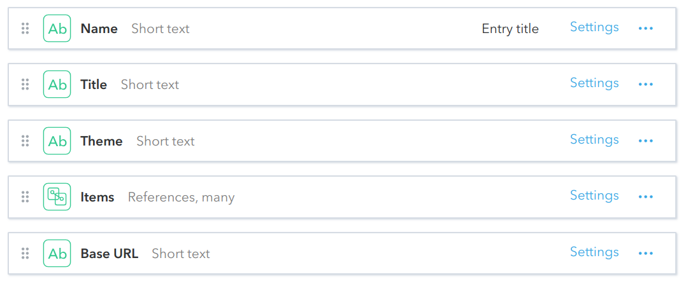
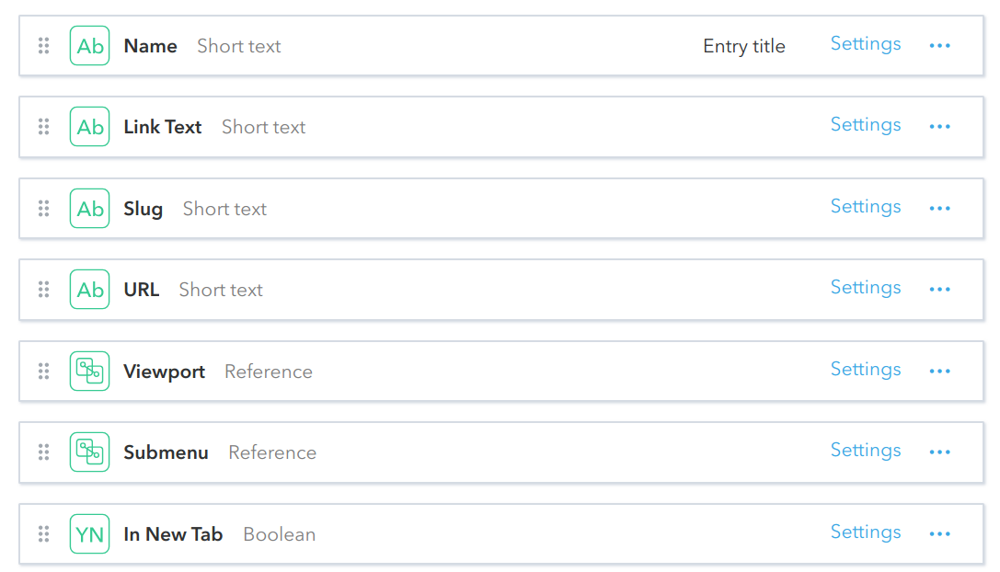

# Navigation Menu
Model that will render navigation menus of links with optional sub-links/menus. Menu items are controlled by **Navigation Menu Item** componets. We plan to add support for [Route](./Route.md) components as well in near future.

## Fields
**Navigation Menu**

**Navigation Menu Item**

## Live Demo
https://community-app.topcoder.com/examples/contentful/viewport/2VtYSyqeFb3XBEsSREIVgP
