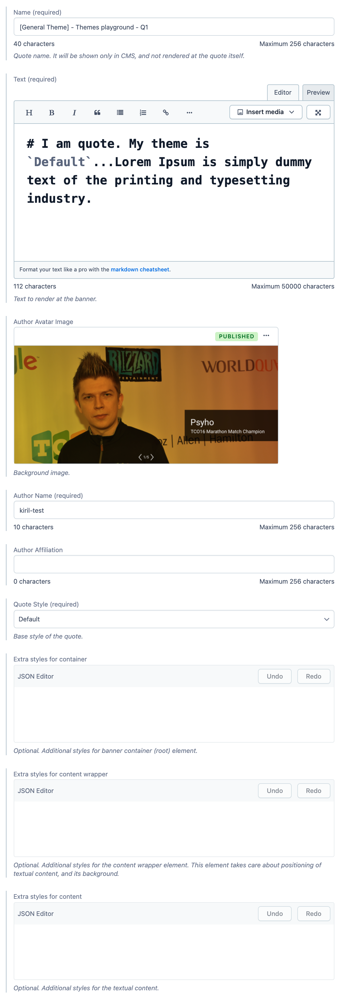

# Quote

Generic Quote model.

**Preview:** https://community-app.topcoder.com/examples/contentful/viewport/7xOMXsGyLLzGUlu8uelMQl

## Fields

- **Name** | Name of the entry.
- **Text** | Text to render as a quote.
- **Author Avatar Image** | Avatar image to be shown.
- **Author Name** | The name that will be displayed below the quote text.
- **Author Affiliation** | Affiliation name that will be displayed right after author name.
- **Quote Style** | Predefined quote style.
- **Extra styles for container** | CSS inline styles to override the container's style.
- **Extra styles for content wrapper** | CSS inline styles to override the content wrapper's style.
- **Extra styles for content** | CSS inline styles to override the content's style.