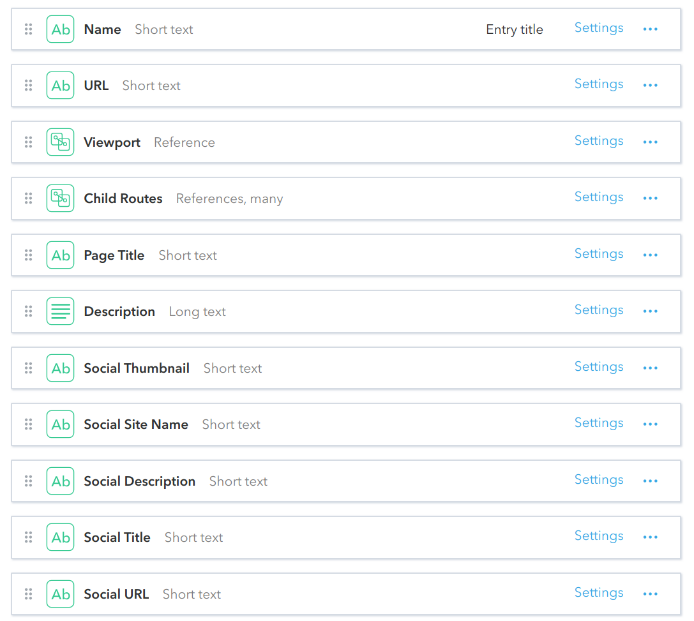

# Route
A Route that can render a Viewport at its endpoint, and also include sub-routes with Viewports. When linked to community-app it will render its [Viewport](./viewport.md) under the specified `URL`.

## Fields

## Live Demo
https://community-app.topcoder-dev.com/examples/contentful/route/7AJwV3vA7OsDjJBFlfIFqr
