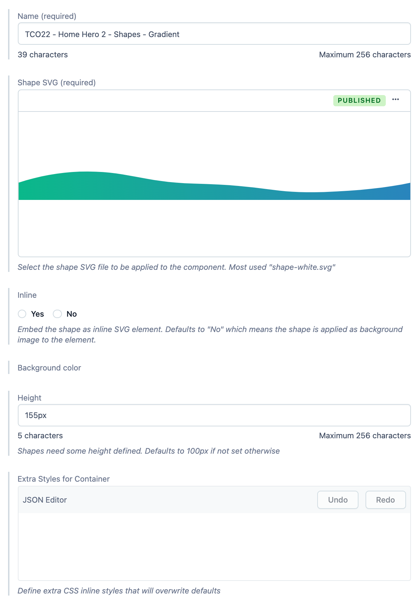

## Shape

Generic Shape model. Primarily used for render shape separator between sections on the page.

**Preview:** https://community-app.topcoder.com/examples/contentful/viewport/1hoEvvNhVOZ3crj94JegC6

## Fields

- **Name** | Name of the entry.
- **Shape SVG** | Shape SVG file to be applied to the page.
- **Inline** | Embed the shape as inline SVG element. Defaults to "No" which means the shape is applied as background image to the element.
- **Height** | Shapes need some height defined. Defaults to 100px if not set otherwise.
- **Extra Styles for Container** | Extra CSS inline styles that will overwrite image container defaults.
