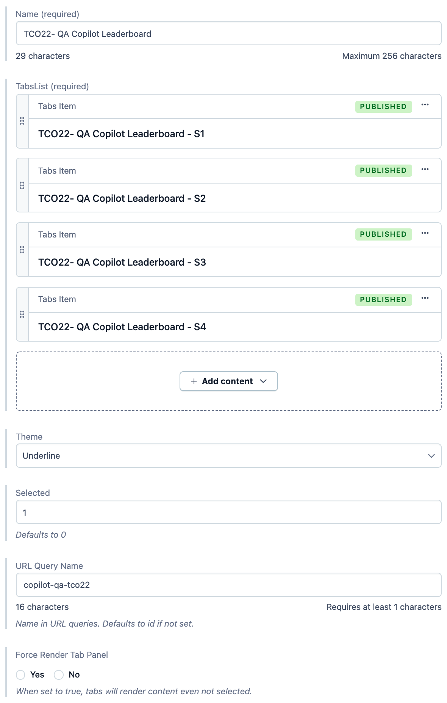
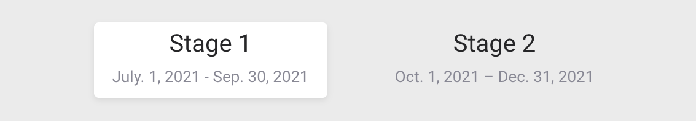
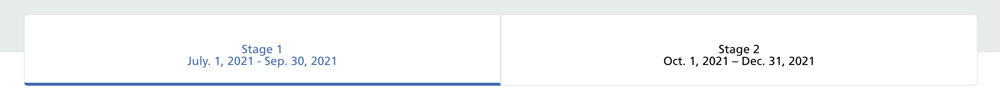
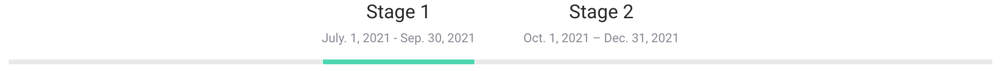
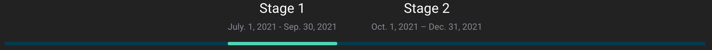
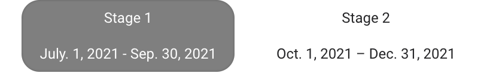
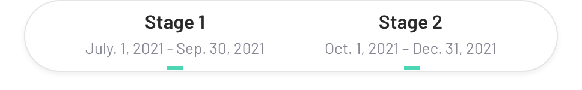

# Tabs

Generic Tabs model. Each tab holds a list of [TabsItem](./TabsItem.md) entry type, that provide content for it.

**Preview:** https://community-app.topcoder-dev.com/examples/contentful/tabs/5WgUyXj8xlPsFSPaMdC1ze

## Fields

- **Name** | Name of the entry.
- **TabList** | List of TabsItem type entry. Please refer to [TabsItem docs](./TabsItem.md) for more details.
- **Theme** | Tabs theme. Please refer to [theme](#theme) for more details.
- **Selected** | Default TabsItem selected.
- **URL Query Name** | Name in URL queries. Defaults to id if not set.
- **Force Render Tab Panel** | When set to true, tabs will render content even not selected.

## Theme

Tabs theme.

### Default

### Zurich

### Underline

### Underline dark

### Pills

### Vertical

### Underline box

