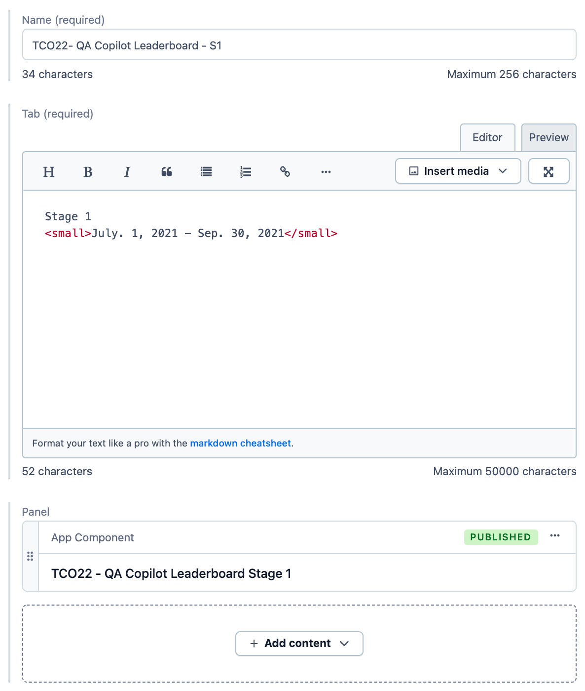

# TabsItem

Generic TabsItem model

**Preview:** https://community-app.topcoder-dev.com/examples/contentful/tabs/5WgUyXj8xlPsFSPaMdC1ze

- **Name** | Name of the entry.
- **Tab** | Content of the tab button.
- **Panel** | Content to render when tab is active.
