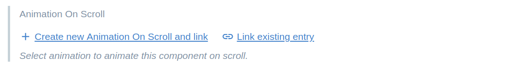
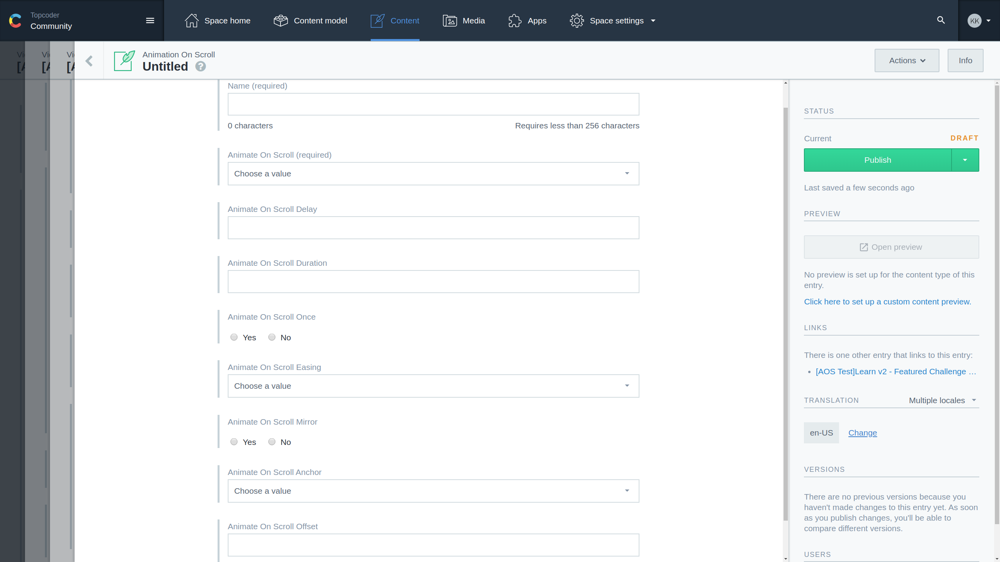

# Animations On Scroll
Animationg Contentful components on scroll is implemetented currently for following components:
- Viewport
- Image
- ContentBlock

Definig a scroll animation is easy via the Web UI. Search for the "Animation On Scroll" field and either select existing animation or create new one.

## Animation Model
To define a default animation only `Name` and `Animate On Scroll` fields are required. There is help hint bellow each fields what is does and how to use it. For further detailed examples see: https://michalsnik.github.io/aos/. All available properties are supported from Contentful animatable components as well.

