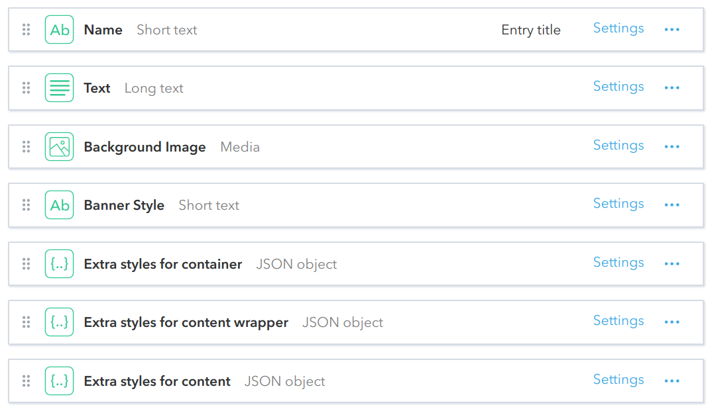

# Banner
This content type provides banners: large background image, some textual content, positioned above it, and also some extra background just under the text, to improve its readability against the main background image. We support a few different banner styles via themes. Moving forward, probably, we will merge **Banner** type into **ContentBlock** one at some point, as there is no much differences between them in term of data they rely on.

## Fields

## Live Demo
https://community-app.topcoder.com/examples/contentful/viewport/2W1Wb1bwEabiIZhaSc4EwV
