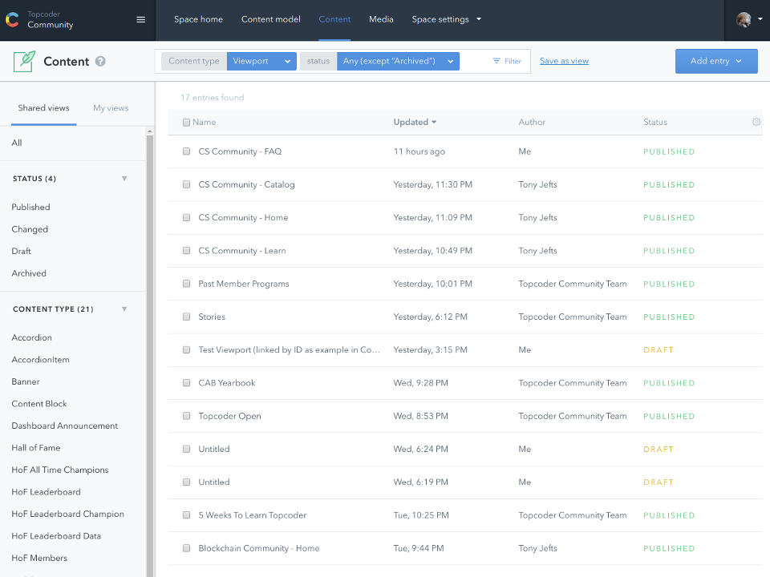
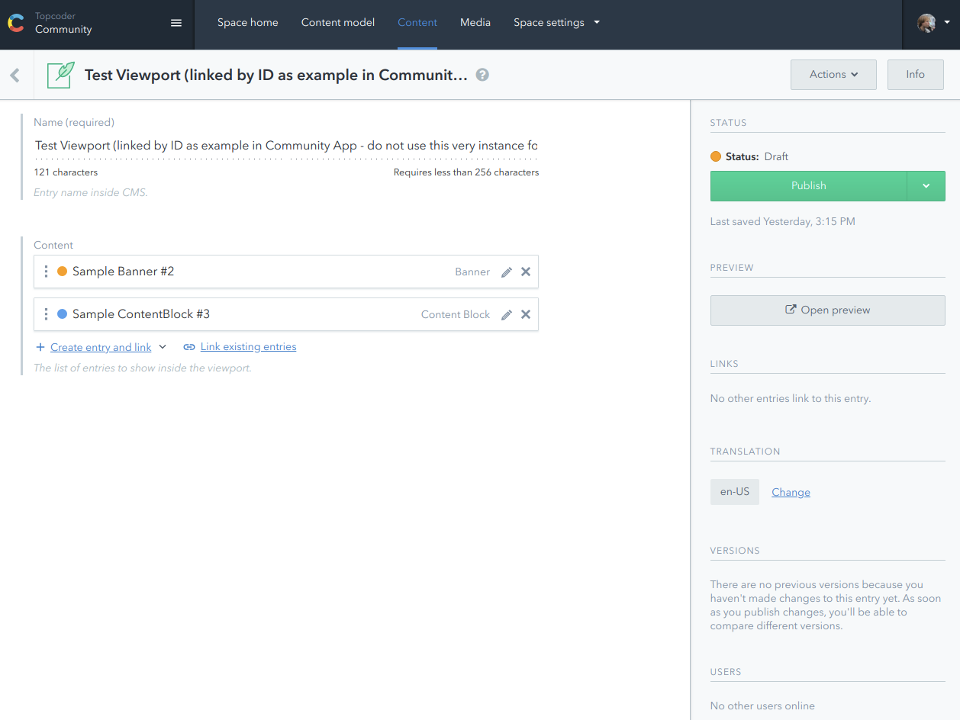

# Basics
As content writer, you will spend most of your time in Contentful, creating new
or editing existing content objects, belonging to various types, and assembling
them together into web pages that fulfil your goals.

Here is one screen you will see often &ndash; content listing:

In addition to the list of content (at the screenshot it shows all
non-archived content entries of *viewport* type, with their names, last update,
author, and status), pay attention to:

- The panels above and left of the list allow to filter it in multiple ways, and
  also store and reuse the searches you need often;

- The *Add entry* button let you create new entries;

- The *Media* tab in the very top menu gives acess to the listing of assets
  (images, documents, etc.) loaded directly into CMS. The asset listing looks
  and works similar to the content listing.

Here is a typical content editing screen (the amount and types of input fields
inside the main part of the page, depends on the type of content object you edit,
in this case &ndash; *viewport* object):

Here are the most important things to note:
- The *Name* field &ndash; it may work differently for some content types, but
  our general convention is to have the *Name* field for each object as its name
  inside CMS, that is used for book-keeping, and is not rendered at the website.
  In some cases, it might be rendered as the default object title, but an extra
  *Title* field will be provided then to override the rendered name.

  ***Beware:*** Currently, especially for *viewports* and *banners*, we often
  rely on their names to query objects to render at specific pages of the website.
  **Changing names of such objects will break pages relying on them**. Stick to
  clear object names in form similar to *Website Segment &ndash; Page &ndash; Purpose*,
  e.g. *Blockchain Community &ndash; Home* for the entire page, and
  *Blockchain Community &ndash; Home &ndash; Get Started* for specific content
  block.

- The *Content* input at the screenshot contains links to other content objects,
  that will be rendered by the viewport as children. Those child objects are
  independent objects, that can be published / edited independently of parent
  viewport, and also can be rendered in different viewports at the same time.
  In the later case, you should remember that they are still represent the
  same object, if you edit it, the edited version will be used everywhere
  that object is referenced.

  **The colored dots**, that you may see in different places of CMS UI, denote
  the current status of related objects:
  - *Orange* &ndash; Draft, not published yet;
  - *Blue* &ndash; Published, but there are further edits pending to be published;
  - *Green* &ndash; Published, no pending edits to publish.

- Contentful CMS automatically saves all your edits (see the *Last saved*
  status under the *Publish* button to double-check whether you edits are
  saved). Typically, you will see your edits at  our website only once you
  have published them. However, for most of object types, we support previews:
  the button in right panel will take you to a specially constructed pages of
  our website, where you will see the latest version of your object, no matter
  published or draft.
