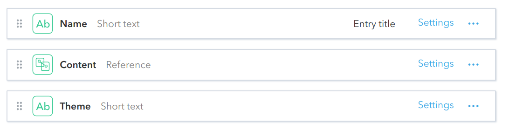

# Custom Inline Components in Markdown Fields

You can use the following custom markup inside Markdown fields of Contentful
components to render custom inline components in the textual blocks. This should
work inside ContentBlock entries, and is supported in entries of
other types too.

## Buttons

- #### Button
  *Example:* `<Button to="/target/link">Label</Button>`

  Renders
  [Default Button](https://community-app.topcoder.com/examples/buttons/) that
  acts as a hyperlink;

- #### PrimaryButton
  *Example:* `<PrimaryButton to="/target/link">Label</PrimaryButton>`

  Renders
  [Primary Button](https://community-app.topcoder.com/examples/buttons/) that
  acts as a hyperlink;

- #### SecondaryButton
  *Example:* `<SecondaryButton to="/target/link">Label</SecondaryButton>`

  Renders
  [Secondary Button](https://community-app.topcoder.com/examples/buttons/) that
  acts as a hyperlink;

- #### Legacy TCO Button
  *Example:* `<TCOButton theme="tco18">TCO18/17 View Competition Rules</TCOButton>`

  Renders
  [Themed Buttons](https://community-app.topcoder.com/examples/contentful/contentblock/3k7k1JpnSvIRrJYWs4izYi);

- #### Themed Button
  *Example:* `<ThemedButton theme="[tc-theme-color-size]">White</ThemedButton>`

  Renders
  [TCOX Legacy Button](https://community-app.topcoder.com/examples/contentful/contentblock/FNmL56lEahdv0irLASC5a) that
  acts as a hyperlink;

## Custom Component

- #### JoinCommunity
  *Example:* `<JoinCommunity label="Join Now" />`

  Renders _Join Community_ button.
  This component will work fine only in pages shown inside Topcoder
  subcommunities (and it will likely break any page / component preview shown
  outside of a subcommunity context). When used inside a subcommunity page, it
  automatically takes subcommunity ID from the context (you do not have to
  specify it explicitely). The `label` property is optional, defaults to
  _Join Community_. The button is not rendered if current user is already a
  member of the community. It automatically shows necessary confirmation modals.

- #### NewsletterSignup
  **Sample Use:** `<NewsletterSignup listId="LIST_ID" />`

  Renders
  email input field, along with subscription button, that subscribes given email
  for a newsletter list. The component handles verification of emails, and modal
  UI windows shown on success and failure of subscription.

  | Param     | Default                  | Description                                                                      |
  | ---       | ---                      | ---                                                                              |
  | label     | Subscribe for Newsletter | Optional. Custom label to show on the button.                                    |
  | listId    |                          | ID of MailChimp list to subscribe.                                               |
  | interests | empty string             | Optional. commas separated string of group ids to which user should be subscribed |

- #### VideoModalButton
  *Example:* `<VideoModalButton videoTitle="Video Title" videoUrl="Video URL" />`

  A button that shows a modal with video when clicked (like the one in the
  header of [Veterans Community's Home Page](https://veterans.topcoder.com/)).

  The properties are:
  - `videoTitle` &ndash; Optional. If specified, it is shown as video title in
    the video modal;
  - `videoUrl` &ndash; URL of the video stream. Current version of the
    component works only with YouTube videos, and the URL should be similar to
    `https://www.youtube.com/embed/mD12LIqdxqk` ().

## Links

- #### Link
  *Example:* `<Link to="/target/link">Link text</Link>`

  Renders a hyperlink.
  While it looks the same as the links rendered with usual Markdown syntax
  `[Link text](/target/link)`, it behaves different under the hood: for local
  links (anything that does not start with schema name, e.g. `http:` or
  `https:`) it creates links that make transition without reloading the app.
  Sometime later we should update our code to handle any links this way.

## Modals
Rendering modal dialogs after click on various triggers like text, link, image, icon and etc. The content of the modal window is referenced by `id` of the modal component which itself is just a wrapper to [Content Block](./ContentBlock.md), [Banner](./banner.md) or [Viewport](./viewport.md).

**Modal Fields**


*Examples of modal usage:*

https://community-app.topcoder.com/examples/contentful/contentblock/75fw42BmbyloyIseNH7gsY

```html
__Text/Link__
<Modal id="6U2MKViRUKnJsw6PbO6201">[Link: Modal](https://topcoder.com)</Modal>
<Modal id="6U2MKViRUKnJsw6PbO6201"><p>Text: Modal</p></Modal>

__Buttons__
<Modal id="4crW9mh55lHR0ouu9SbJ5i"><PrimaryButton>PrimaryButton: Modal</PrimaryButton></Modal>
<Modal id="4crW9mh55lHR0ouu9SbJ5i"><Button>Button: Modal</Button></Modal>

__Icons__
<Modal id="6U2MKViRUKnJsw6PbO6201"></Modal>
<Modal id="6U2MKViRUKnJsw6PbO6201"></Modal>
<Modal id="6U2MKViRUKnJsw6PbO6201"><i className="fa fa-user" /></Modal>

__Inline Styled__
<Modal id="6U2MKViRUKnJsw6PbO6201"></Modal>
```