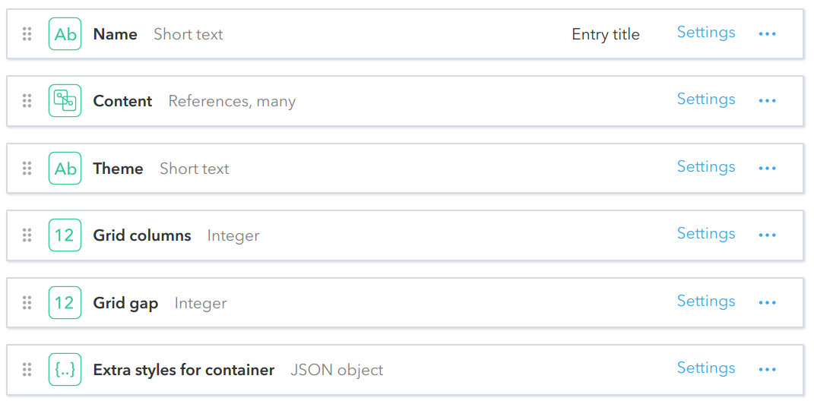

# Viewport

A generic container for other objects, that renders its children into a container element. It supports nested viewports, different layout options for viewport content via themes. Viewport should be considered as the main content layout and grouping component.

## Fields

## Live Demo
https://community-app.topcoder.com/examples/contentful/viewport/7yVst7wTJIalmNhRoUNAWp
