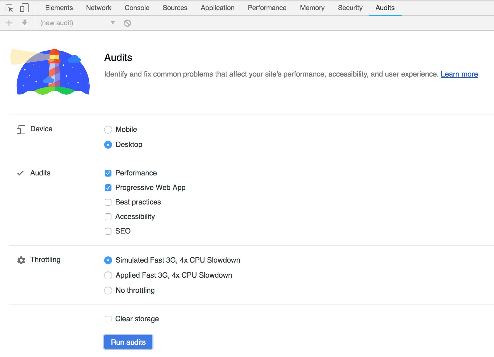
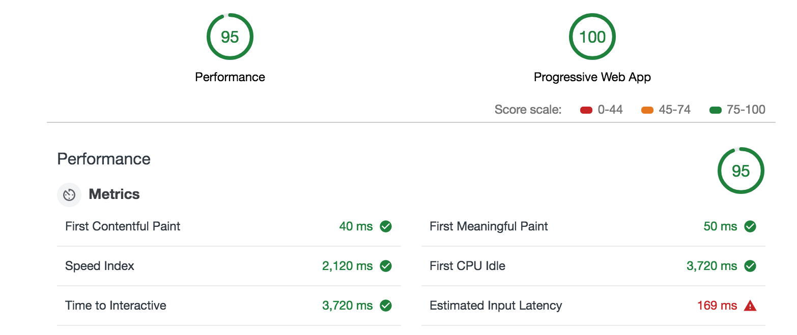

## Audit PWA App

1. Start community-app:

   ```shell
   # Checkout community-app mm-feature-experiment branch
   git clone https://github.com/topcoder-platform/community-app
   cd community-app
   git checkout mm-feature-experiment
   git clean -fd
   git reset --hard
   
   # Install dependencies
   rm -rf node_modules && npm i
   
   # Build app
   npm run build
   
   # Start app
   NODE_CONFIG_ENV=production npm start
   ```


2. Audit

   Open https://local.topcoder.com/challenges in Chrome.

   

   **Note: when the page first loaded, the service worker is initially installed and does not get a chance to cache everything need. To get best audit performance, at first reload the page so that everything need will be cached.**

   

   Then open Developer Tools, go to Audits tab, select "Performance" and "Progressive Web App", **unselect "Clear storage" to get best audit performance**:

   

   


3. The audit result (Mobile and Desktop audit results are similar). You can audit multiple times to get average result:

   

