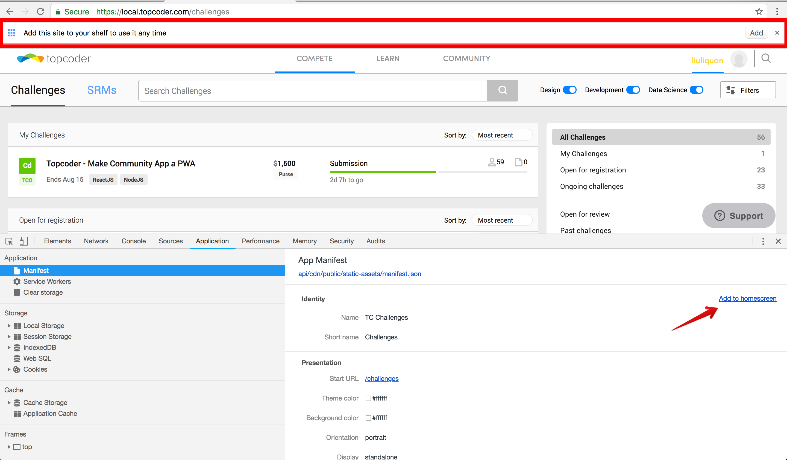
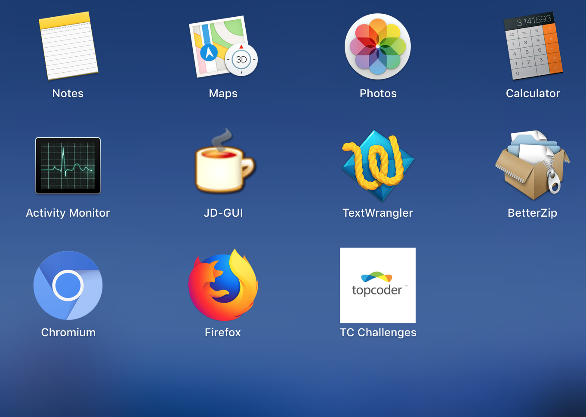
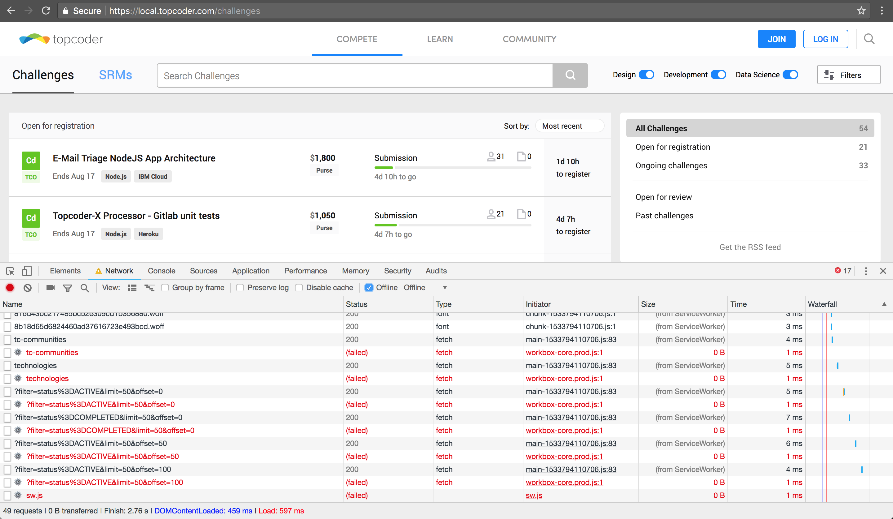

## Prerequisite

Git

Nodejs 8

Nginx 1.14 for HTTPS server

Chrome 68 for test


## Setup Nginx Server

PWA requires HTTPS. Follow `nginx/Setup.md` to setup Nginx HTTPS server.


## Audit PWA App

Follow `Audit.md`.


## Add to HomeScreen

***Note this does NOT work in Chrome Incognito window.***

Goto https://local.topcoder.com/challenges . In Chrome Developer Tools, Application tab, click `Manifest`, then click `Add to homescreen`, a banner will show on the top of page:




Then you can click `Add` to create shortcut, following is the "TC Challenges" shortcut created on my Mac launchpad:




## Offline Support

**Note: when the page first loaded, the service worker is initially installed and does not get a chance to cache everything need. To get offline works, at first reload the page so that everything need will be cached.**

Then open Chrome Developer Tools, Network tab, check `offline`.

Then reload the page, it should still render, you can see some requests are served from ServiceWorker:




## Development Build

To verify development build of community-app:

```shell
# Build app
npm run build:dev

# Start app
NODE_CONFIG_ENV=development npm run dev
```


## Kill Switch

1. To clear a cache, you can update its version number, see `src/server/sw.js` for details. But normally you don't need do this because:
   - The js/css themselves are already versioned by webpack building
   - The cache will be auto cleared when cache quota size limit exceeded

2. To disable PWA service worker, set environment variable `DISABLE_SERVICE_WORKER ` to true.
3. To install new service worker, you just rebuid the app. The new service worker will be auto installed.